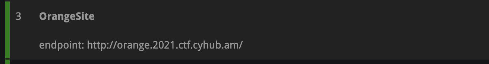
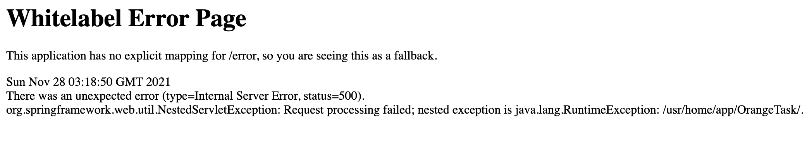
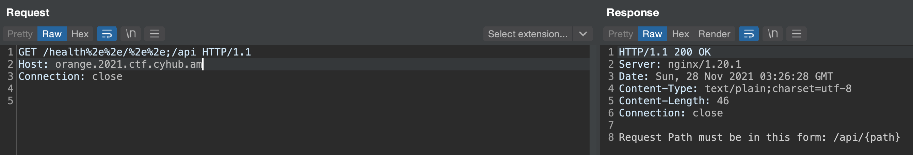
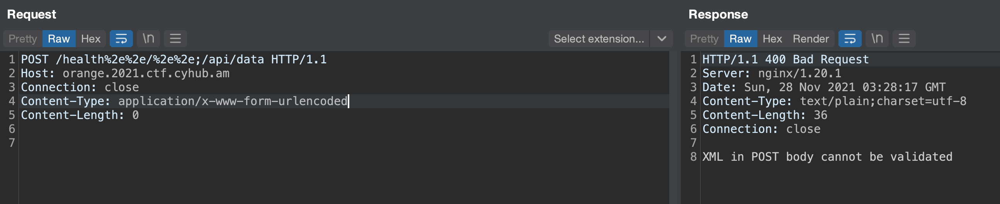
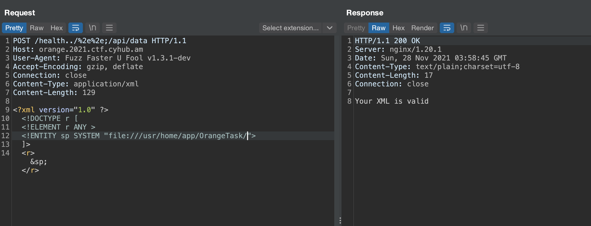
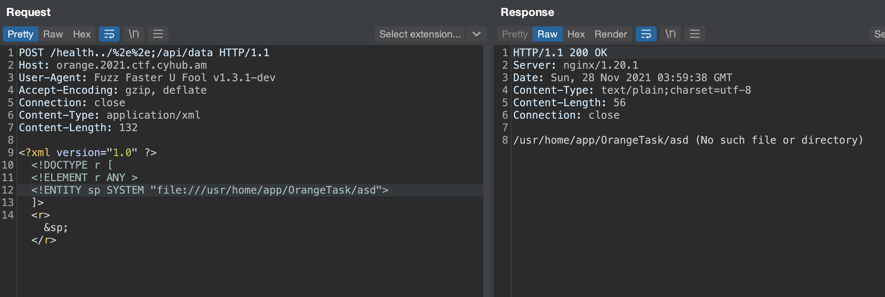
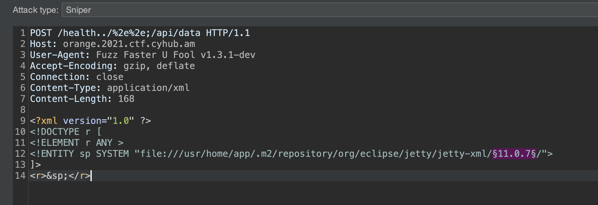
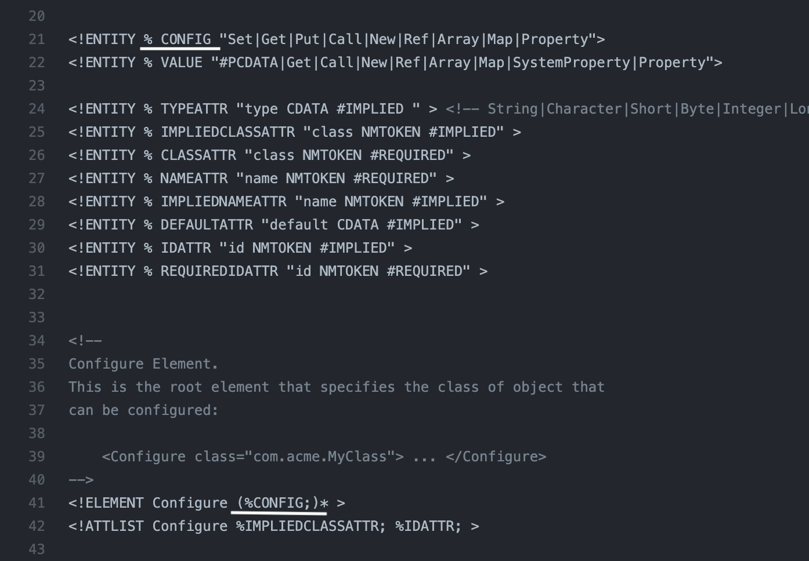
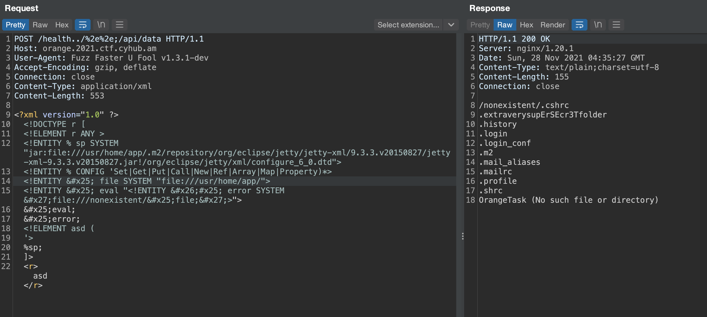
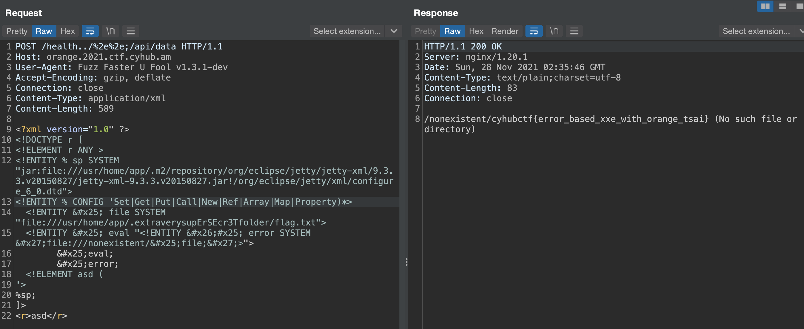

# OrangeSite - "1 CAT COMPANY CTF" spring xxe challenge


On November 27 [Cyhub Armenia](https://cyhub.am/) organized a very fun local CTF event - [1 CAT COMPANY CTF](https://2021.ctf.cyhub.am/) and [Hayk Andriasyan](https://hackerone.com/p0wn4j?type=user) created an [XXE challenge](http://orange.2021.ctf.cyhub.am/) for it.
<!--more-->


As a task description, we get only the task location:


Visiting [which](http://orange.2021.ctf.cyhub.am/) we see nothing helpful, so we run our web fuzzer with a generic wordlist and get some interesting endpoints - `/health`, a health service actuator endpoint, `/test` some spring endpoint which throws java error containing script's full path, `/api`, which returns 403 forbidden response.


Combing what we got - task's name clearly referring to [Orange Tsai](https://twitter.com/orange_8361), NginX server, we can clearly understand we must have NginX [off by slash](https://www.youtube.com/watch?v=voTHFdL9S2k) directory traversal vulnerability, so we try traversing to `/api` endpoint discovered before and succeed



Fuzzing for the obvious `{path}`, we find `/api/data` endpoint which expects XML body 


So we try to exploit the XXE accessing external services via http/https and getting blocked by the parser, accessing external ftp server via [file protocol](http://immunityservices.blogspot.com/) and failing. But we see quickly the difference between existent and non existent file paths. When the server responds `Your XML is valid` the file exists and `/somepath (No such file or directory)` when it doesn't. 





Then we realize that the only way to exfiltrate the data is through [exploiting xxe with local dtd files](https://mohemiv.com/all/exploiting-xxe-with-local-dtd-files/). After trying some known gadgets we fail, so we should find a gadget ourselves. To do so we run a FreeBSD VM, as we know [Antranig Vartanian](https://twitter.com/antranigv), who is hosting the challenges, is a huuge FreeBSD fan and contributor, installing most probable maven dependencies like `spring boot` and `jetty`. And to find local dtd files we run the [dtd finder](https://github.com/GoSecure/dtd-finder) tool made by [GoSecure](https://gosecure.net/) in our home directory with the following command.

```BASH
java -jar dtd-finder-1.1-all.jar /home/tmp-user/.m2/ > out
```

Which yields the following results:

```
/.m2/repository/org/eclipse/jetty/jetty-xml/9.4.31.v20200723/jetty-xml-9.4.31.v20200723.jar!/org/eclipse/jetty/xml/configure_9_0.dtd
/.m2/repository/org/eclipse/jetty/jetty-xml/9.4.31.v20200723/jetty-xml-9.4.31.v20200723.jar!/org/eclipse/jetty/xml/configure_7_6.dtd
/.m2/repository/org/eclipse/jetty/jetty-xml/9.4.31.v20200723/jetty-xml-9.4.31.v20200723.jar!/org/eclipse/jetty/xml/configure_9_3.dtd
/.m2/repository/org/eclipse/jetty/jetty-xml/9.4.31.v20200723/jetty-xml-9.4.31.v20200723.jar!/org/eclipse/jetty/xml/configure_6_0.dtd
```

To find which jetty version the server is using, we pull [the repo](https://github.com/eclipse/jetty.project), extract version tags, feed it to Burp's Intruder and find that it is using `9.3.3.v20150827`


We choose `configure_6_0.dtd` [file](https://github.com/maharshi95/Jetty/blob/master/jetty-xml/src/main/resources/org/eclipse/jetty/xml/configure_6_0.dtd) to create our gadget as we have a perfect candidate `CONFIG`, which gets reflected few lines after.


To create the gadget we should escape `CONFIG` reflection on line 41

```XML
<!ENTITY % CONFIG 'Set|Get|Put|Call|New|Ref|Array|Map|Property)*>
<!ENTITY &#x25; file SYSTEM "file:///usr/home/app/">
<!ENTITY &#x25; eval "<!ENTITY &#x26;#x25; error SYSTEM &#x27;file:///nonexistent/&#x25;file;&#x27;>">
  &#x25;eval;
  &#x25;error;
<!ELEMENT asd ('>
```

Sending the payload we get directory listing for the `/usr/home/app/` folder


Finally, in `.extraverysupErSEcr3Tfolder` folder, we find `flag.txt`


Thanks Cyhub for such a great event !.

