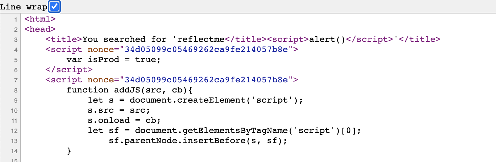
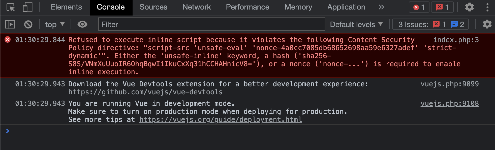
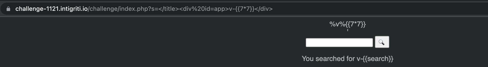
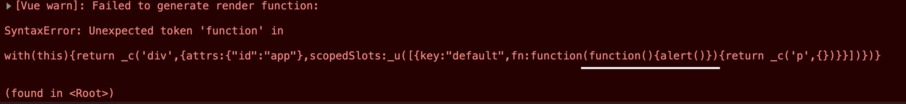
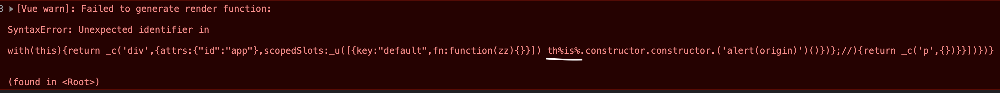
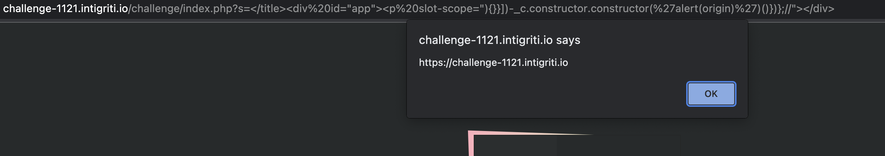

# From Intigriti challenge to a Vue.js script gadget

Intigiriti's November [challenge](https://challenge-1121.intigriti.io/) by [IvarsVids](https://twitter.com/IvarsVids) was about a [Vue.js](https://vuejs.org/) one-pager that reflected user input with some replacements. After visiting the challenge homepage at https://challenge-1121.intigriti.io/ we quickly notice it reflects `s` query parameter not escaping HTML less than and greater than signs resulting in [HTML injection](https://challenge-1121.intigriti.io/challenge/index.php?s=reflectme%3C/title%3E%3Cscript%3Ealert()%3C/script%3E).
<!--more-->

But the page refuses the execute the injected script because of the content security policy `base-uri 'self'; default-src 'self'; script-src 'unsafe-eval' '<emitted>' 'strict-dynamic'; object-src 'none'; style-src '<emitted>'`

As we see `unsafe-eval` directive is present, which means dynamically eval'ed script will be allowed, so we can try vue.js template injection. To achieve that we should inject our element with `app` "id", close the `<title>` with a payload like `</title>

` and inject the payload within the div. Template delimiters are set to `v-{{` and `}}` on line 45 but after trying to inject templates or general script gadgets from [Portswigger's cheatsheet](https://portswigger.net/web-security/cross-site-scripting/cheat-sheet#vuejs-reflected) the WAF is replacing keywords with `%` characters.

Looking for a potential execuntion sink I refered to Vue api at [https://vuejs.org/v2/api/](https://vuejs.org/v2/api/) and found [slot-scope](https://vuejs.org/v2/api/#slot-scope-deprecated) deprecated special attribute which is expecting `function argument expression`. Trying to inject payload like `</title>

` we get the following expection.

So to execute javascript we should close the function expression and then execute our javascript code, but also please note the injection point is within a smaller scope and `window` parameters are not within this scope. To escape to `window` scope we can try the classic `this.constructor.constructor` chain. Injecting a payload like the following we get another exception`</title>

`

WAF has replaced `is` from `this` with `%is%` as it is another known script gadget attribute, but we can bypass this using a function from the local scope, e.g. `</title>

`

For the intended solution check Intigriti's guide at [https://www.youtube.com/watch?v=-_7uL7l0qZk](https://www.youtube.com/watch?v=-_7uL7l0qZk).

